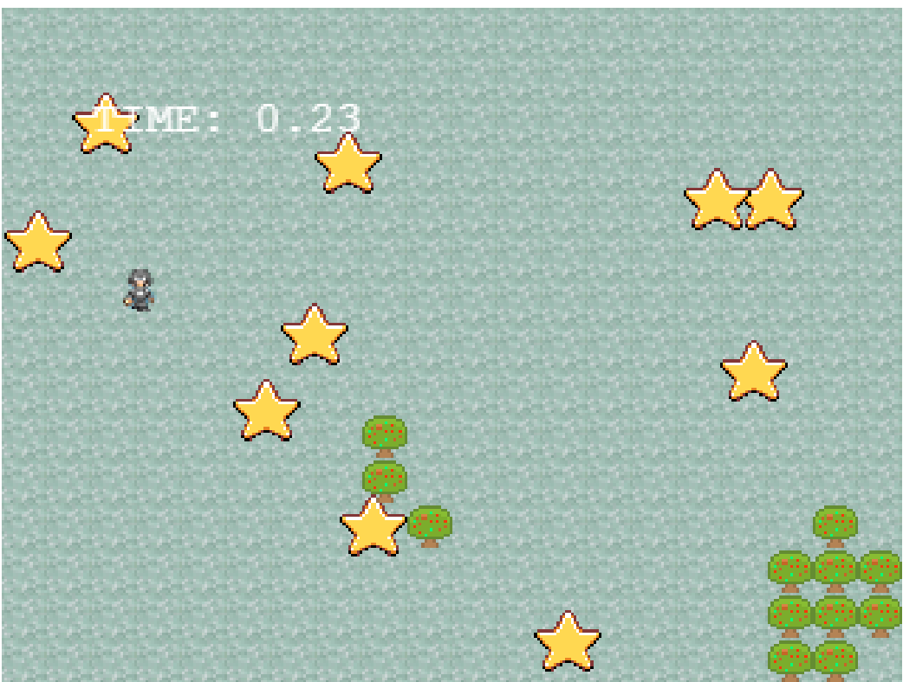

# Secret Ninja Star

> A simple RPG game built with Phaser 3.

## Game instructions

- Players must try to collect the stars as fast as they can.
- To collect a star, simply walk through it.
- Players must find the Secret start before time runs out.
- The time acts as the score.
- The goal is to find the secret star in the least amount of time.
- The secret star might be trapped inside of an obstacle such as a tree or unfinished building. If the secret star is one of those trapped stars, then the player will not get the highest score. One must be fast and lucky to get the highest score.
- After a game has finished, the leaderboard will pop-up to show the player where he stands among the best Secret Ninja Star players.

[Click Here  to read the Game Design Document](./game-instructions)

## Built With

- JavaScript, CSS, HTML.
- Phaser 3
- Webpack, Jest, Babel, eslint, stylelint, webhint.

## Live Demo

[Play Cat Jump](https://paul-clue.github.io/JavaScriptCapstone/)

## Getting Started

To get a local copy up and running follow these simple example steps.

- On the top of the page there is a green button name "Code"
- Click on the "Code" button.
- A Menu will appear click in "Download Zip"
- Save the "JavaScriptCapstone-feature-game" folder to any suitable directory on your computer.
- Extract the contents of the "JavaScriptCapstone-feature-game.zip" you just downloaded in the folder.

### Prerequisites

- nodeJS.
- A browser.

### Setup

- Open your comand prompt.
- Go inside the folder "JavaScriptCapstone-feature-game".
- Type `npm install`.

### Usage

- Open your comand prompt.
- Go inside the folder "JavaScriptCapstone-feature-game".
- Type `npm run start`. The game will load in your browser.

### Run tests

- Open your comand prompt.
- Go inside the folder "JavaScriptCapstone-feature-game".
- Type `npm run test`.

## Author

👤 **Paul Clue**

- GitHub: [@PaulClue](https://github.com/Paul-Clue)
- LinkedIn: [Paul Clue](https://www.linkedin.com/in/paul-clue/)

## 🤝 Contributing

Contributions, issues and feature requests are welcome!

## Show your support

Give a ⭐️ if you like this project!

## 📝 License

This project is [MIT](LICENSE) licensed.

## Acknowledgments

- Game assets are from the Phaser 3 tutorial by By Richard Davey,  Creating a Phaser 3 Template by Scott Westover, and the OpenGameArt website.